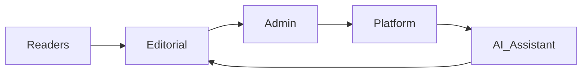
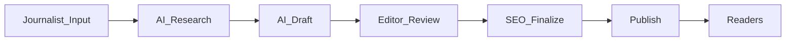

# THETUNISTIME Project Overview and Vision

Mobile first, bilingual AI powered news platform for Tunisia with a research grade AI assistant integrated in the back office to accelerate high quality journalism.

Stack baseline
- Frontend Next.js App Router
- Backend Django
- Database PostgreSQL
- AI Google Gemini 2.5 Pro

Destination workspace
- Notion page THETUNISTIME Project

---

## 1. Executive Summary

The THETUNISTIME platform delivers a fast, secure, and fully bilingual news experience in Arabic and French, optimized for mobile networks prevalent in Tunisia. The public site provides regional coverage across all Tunisian governorates and core categories including Politics, Economy, Sports, and Culture. The back office features an AI Assistant capable of deep web research and structured draft generation with full source citation to support journalists and editors in producing verified and analysis rich articles. The editorial remains in full control, with workflows designed for transparency, speed, and ethics.

---

## 2. Audience

- Readers
  - General Tunisian public using mobile devices
  - Bilingual consumption in Arabic RTL and French LTR
  - Interest in regional news per governorate and national categories

- Back office users
  - Administrators managing users, roles, permissions, and global settings
  - Editors reviewing drafts, enforcing standards, scheduling, and publishing
  - Journalists producing content, initiating AI research, and drafting articles

---

## 3. Value Proposition

- Bilingual and RTL optimized news experience
- Regional targeting per governorate to increase relevance
- Mobile first performance highly tuned for Tunisian networks
- AI Assistant that accelerates research and draft creation without replacing editorial judgment
- Transparent source citation allowing rapid fact checking and verification
- Secure, scalable architecture aligned to modern SEO and accessibility practices

---

## 4. Goals and Objectives

- Content velocity
  - Increase publishable draft throughput per journalist while maintaining rigorous review

- Quality
  - Enforce editorial standards through workflows, checklists, and source transparency

- Performance
  - Achieve Core Web Vitals targets on mid range mobile devices and 3G or 4G networks

- Bilingual experience
  - Provide complete RTL and LTR support with consistent UX and typography for Arabic and French

- SEO excellence
  - Implement hreflang, canonical, structured data, and clean slugs to maximize visibility

---

## 5. Scope

### 5.1 Public site features

- Homepage
  - Featured articles carousel or grid
  - Latest news feed
  - Regional section organized by governorates
  - Prominent language switcher AR FR

- Article page
  - Optimized readability for Arabic and Latin scripts
  - Social sharing for Facebook WhatsApp Instagram
  - Related articles
  - Comment section with moderation

- Category pages
  - Politics Economy Sports Culture and more
  - Pagination and SEO friendly listing

- Regional pages
  - Dedicated page per governorate
  - Filtering and navigation by region

### 5.2 Back office features

- Bilingual interface AR FR
- User management and roles
  - Administrator Editor Journalist
- Content management
  - CRUD for articles
  - Category and regional tagging
  - Media library with alt text in both languages
- Workflows
  - Draft Review Publish
  - Scheduling and embargo
  - Versioning and audit logging

### 5.3 AI Assistant module

- Research
  - Input field for query and language selection AR FR EN
  - Deep search across news outlets official sources press releases and reports
- Generation
  - Structured draft with suggested headline intro body conclusion
- Source citation
  - List of source URLs with summaries for verification
- Editor integration
  - Populate rich text editor for human refinement and SEO metadata

---

## 6. Out of Scope Initial Phase

- Paywall and subscription systems
- Real time comment threads beyond basic moderation
- Complex personalization and recommendation engines
- Native mobile applications independent of web PWA
- Live video streaming and large scale media ingestion pipelines

---

## 7. Dependencies and Assumptions

- Stable access to Google Gemini 2.5 Pro APIs with appropriate quotas
- Reliable hosting for Next.js and Django and PostgreSQL
- CDN for static assets and images
- Editorial staffing and governance
- Compliance with local regulations regarding media and privacy

---

## 8. Constraints

- Mobile network variability in Tunisia
- RTL typography and layout fidelity across devices
- Mixed language content requiring nuanced SEO hreflang and canonical management
- Ethical AI usage and non plagiarism standards
- Budget and operational capacity for AI API usage

---

## 9. Non Functional Targets Summary

- Performance
  - LCP under 2.5s on Fast 3G for top pages
  - TTI under 4s for article pages on mid range devices
  - Image optimization with modern formats and responsive sizes

- Security
  - HTTPS everywhere and secure headers
  - OWASP aligned controls for common web risks
  - RBAC enforced for back office actions

- SEO
  - Hreflang and canonical across bilingual and regional pages
  - JSON LD structured data for Article and Breadcrumb
  - Clean URL slugs and sitemaps

- Accessibility
  - WCAG AA target
  - Keyboard navigation and ARIA roles
  - Color contrast and focus visibility
  - RTL specific accessibility considerations

- Scalability
  - Horizontal scaling for Next.js and Django
  - Database tuning and read replica readiness

---

## 10. Editorial and AI Ethics

- AI Assistant is a research and drafting tool not an automated publisher
- Mandatory source citation with URLs
- Clear differentiation between facts and AI synthesized narrative
- Journalists must verify claims and add original reporting
- Plagiarism prevention through synthesis and attribution
- Transparency in editorial notes when AI assistance is used

---

## 11. Security and Privacy Baseline

- RBAC with Administrator Editor Journalist roles
- Strong authentication and session management
- Audit logging for sensitive actions publish edits deletions
- Media license tracking and credits
- PII handling minimalism for comments and user profiles
- Secrets management and key rotation for AI and infrastructure

---

## 12. Accessibility Baseline

- Arabic RTL semantics and mirrored UI components
- Semantic HTML and headings
- Screen reader friendly labels and alt text in Arabic and French
- Keyboard operability including language switcher
- Contrast compliant palettes and typography choices

---

## 13. Internationalization Strategy Summary

- Locale routing and language switcher AR FR
- Content translation workflow integrated with editorial review
- Language specific SEO tags and slugs
- RTL aware design system and components
- Regional metadata tagging for governorates

---

## 14. Success Metrics and KPIs

- Publishing throughput per journalist per week
- Draft to publish lead time median and 90th percentile
- Core Web Vitals score distributions by device class
- Organic search impressions and CTR for bilingual pages
- Retention and repeat visits across regions
- Editorial review rework rate as a quality signal

---

## 15. Release Phases

- Phase 1 Foundations
  - Public site core pages bilingual support and basic AI research pipeline
- Phase 2 Editorial acceleration
  - Advanced workflows scheduling and richer AI draft features with citation
- Phase 3 Optimization
  - Performance tuning SEO enhancements accessibility refinements and observability improvements

---

## 16. Risks Overview

- AI hallucinations and source misattribution
  - Mitigation human verification and citation panels
- Performance regressions on lower end devices
  - Mitigation budget based loading and image optim
- SEO complexity with bilingual and regional routing
  - Mitigation strict canonical and hreflang rules
- Security incidents due to misconfigured roles
  - Mitigation RBAC and audit trail with reviews

---

## 17. Stakeholders and RACI

- Responsible Journalists Editors
- Accountable Administrators Editorial leads
- Consulted Legal and Compliance SEO
- Informed Wider organization and readers

---

## 18. Governance and Change Management

- Editorial standards documented and enforced via checklists
- Technical change reviews and approvals for releases
- Incident response procedures for content and platform issues
- Regular retrospectives and metrics reviews to drive continuous improvement

---

## 19. Mermaid Diagrams

Stakeholder map

High level AI assisted editorial workflow

---

## 20. Glossary

- RTL
  - Right to Left layout and typography for Arabic
- LTR
  - Left to Right layout for French
- LCP
  - Largest Contentful Paint
- TTI
  - Time to Interactive
- RBAC
  - Role Based Access Control
- Hreflang
  - SEO attribute indicating language and regional targeting

---

## 21. Acceptance Criteria Snapshot

- Public site
  - Language switching works across all pages
  - RTL layout is consistent and mirrored correctly
  - Category and regional pages render with pagination and SEO tags

- Back office
  - Roles enforced with correct permissions
  - AI Assistant produces drafts with source citation lists
  - Rich Text Editor integration allows full manual edits and SEO metadata

- Performance and SEO
  - LCP under 2.5s Fast 3G for homepage and article page
  - JSON LD Article schema present on article pages
  - Sitemaps and hreflang configured for AR and FR

- Security and a11y
  - HTTPS only and secure headers present
  - WCAG AA baseline met for key flows including language switcher and comments

---

## 22. Cross References

- See System Architecture for deployment topology and service design
- See Data Model for ERD and governorate taxonomy
- See API Contracts for Next.js and Django endpoints and auth flows
- See Performance Strategy for CWV targets and image pipeline
- See SEO and SMO Strategy for structured data and hreflang implementation
- See i18n and RTL Strategy for locale routing and design system
- See Accessibility Guidelines for WCAG practices and RTL specifics
- See DevOps CI CD for pipelines infrastructure and observability

---

## 23. Next Steps

- Validate editorial requirements against proposed workflows
- Finalize governorate taxonomy and region tagging conventions
- Proceed to detailed functional requirements and architecture design