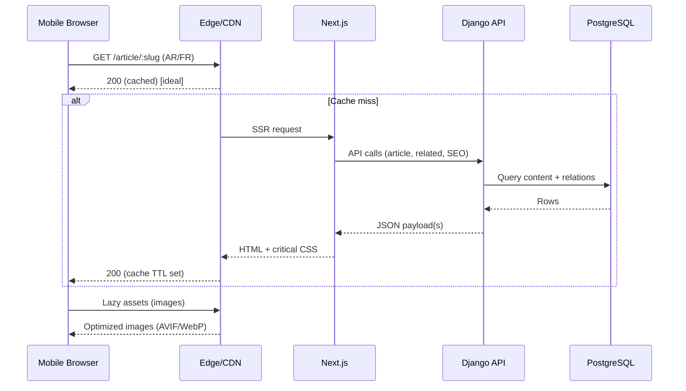
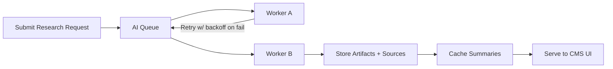
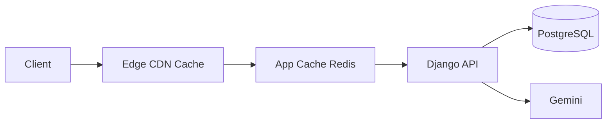

# Non-Functional Requirements (NFR)

Comprehensive non-functional requirements for THETUNISTIME, a bilingual, mobile-first, AI-assisted news platform for Tunisia.

Stack baseline
- Frontend Next.js App Router
- Backend Django
- Database PostgreSQL
- AI Google Gemini 2.5 Pro

Cross-references
- See Project Overview [docs/01-project-overview.md](docs/01-project-overview.md)
- See Functional Requirements [docs/02-functional-requirements.md](docs/02-functional-requirements.md)
- See System Architecture (to be authored) [docs/04-system-architecture.md](docs/04-system-architecture.md)

---

## 1. Performance and Core Web Vitals

Targets (Critical user journeys: Homepage, Article, Category, Regional)
- LCP
  - Target ≤ 2.5s on Fast 3G for 75th percentile users
- CLS
  - Target ≤ 0.1 on all primary pages
- INP
  - Target ≤ 200ms for interactive UIs
- TTI
  - Target ≤ 4s on article pages for mid-range Android devices
- TBT (SSR pages)
  - Target ≤ 200ms

Mobile network assumptions
- Optimize for Fast 3G and Slow 4G
- Baseline device class: mid-range Android (2–4 GB RAM)

Next.js strategy
- Prefer SSR for dynamic pages and ISR (Incremental Static Regeneration) for article/category/region pages with short revalidation windows (e.g., 60–300s)
- Pre-render hero content above the fold
- Route-level code splitting and dynamic imports for non-critical widgets
- Avoid client-side JS for presentational components; prefer CSS-only where feasible

Django strategy
- Use REST API endpoints designed for SSR data hydration
- Query optimization with select_related/prefetch_related
- Annotate counts (e.g., per governorate) via materialized views (optional) or cached aggregates

Caching layers
- Edge/CDN caching for static assets and public pages
- HTTP caching with ETag/Last-Modified for API reads
- Application cache (Redis) for hot endpoints and AI artifact summaries
- Image CDN with on-the-fly resizing and AVIF/WebP

Images
- Use Next.js Image Optimization with device-targeted breakpoints
- AVIF/WebP, responsive srcset, lazy loading below the fold
- Preload hero image if it meaningfully improves LCP

Fonts and typography
- System fonts preferred; if custom fonts are required, subset Arabic and Latin separately, use font-display optional or swap
- Preconnect/preload only when profiling shows material gain

Budgets
- Homepage JS ≤ 180KB compressed; Article page JS ≤ 140KB compressed
- CSS ≤ 60KB compressed (critical CSS inline ≤ 20KB)
- Images above the fold ≤ 120KB compressed cumulative

Performance testing
- Lighthouse CI in CI/CD
- Synthetic tests on Fast 3G profiles
- Real user monitoring (RUM) for CWV in production

Mermaid: request path performance-critical flow

---

## 2. Security

Standards
- Align with OWASP ASVS and OWASP Top 10
- HTTPS-only; HSTS with preload after initial validation
- Secure headers via Next.js middleware and Django SecurityMiddleware
  - X-Content-Type-Options: nosniff
  - X-Frame-Options: DENY
  - Referrer-Policy: strict-origin-when-cross-origin
  - Permissions-Policy: strict set (camera, mic, geolocation off by default)

Authentication and authorization
- Back office
  - Strong session or JWT with short-lived access tokens and refresh tokens server-side rotation
  - RBAC for Administrator, Editor, Journalist
- Password policies and MFA for admin/editor accounts (optional but recommended)
- Rate limiting login attempts and sensitive endpoints

Input validation and sanitization
- Server-side validation for all fields; HTML sanitization for comments and rich text
- Prevent XSS via strict CSP; sanitize embedded content
- Prevent CSRF on forms (Django CSRF + double-submit cookie if applicable)

API security
- Versioned endpoints; avoid exposing internal enums/IDs where unnecessary
- ETags and cache-control headers with proper scoping
- Signed URLs for restricted media downloads if needed

Secrets management
- Store secrets (Gemini API, Notion token) in secure vault or environment variables on server; never client side
- Key rotation policy; avoid committing secrets to VCS

Audit and logging
- Immutable audit logs for workflow transitions, publish actions, deletions
- IP and user agent capture for admin actions with retention policy

Dependencies
- Automated SCA (Software Composition Analysis) and dependency pinning
- Renovate/Dependabot for updates with weekly cadence

---

## 3. SEO Excellence

International SEO
- Hreflang tags for AR and FR page pairs
- Canonical URLs per locale; avoid canonicalizing across languages
- Locale-aware slugs (avoid transliteration errors; consistent mapping rules)

Structured data
- JSON-LD for Article, BreadcrumbList, Organization
- Include publish/modified dates, author, headline, image object, section/category

Sitemaps
- Separate sitemaps per locale (sitemap-ar.xml, sitemap-fr.xml)
- Index sitemap referencing locale sitemaps
- Update on publish events and nightly re-generation

Pagination SEO
- Use rel next/prev where applicable; canonical to the current page

Performance SEO
- CWV thresholds as defined; prefetch/prerender measured via profiles, not blanket usage

Open Graph and social cards
- og: and twitter: cards per locale with safe fallbacks

---

## 4. Scalability and Reliability

Scaling model
- Horizontally scale Next.js server and Django API nodes
- PostgreSQL primary with optional read replicas; connection pooling (pgBouncer)
- Redis for caching and queues

AI workload isolation
- Separate AI job workers to avoid blocking web/API threads
- Queue system (RQ/Celery) for deep search and generation tasks
- Back-pressure: cap concurrent AI jobs per user and per org; queue with priority

Rate limiting and quotas
- Per-IP and per-user rate limits for public and admin endpoints
- AI module quotas per role (e.g., max research ops/hour)

Resilience patterns
- Circuit breakers and retries for AI API calls (exponential backoff)
- Idempotency keys for job submission and upload to Notion
- Graceful degradation (show cached content if upstream degraded)

Availability goals
- Target 99.9% monthly availability for public site
- SLOs defined for API latency p95 ≤ 250ms (cache hits), ≤ 600ms (cache miss)

---

## 5. Accessibility (a11y)

Standard
- WCAG 2.2 AA target

RTL specifics
- Direction-aware components; html dir attribute set per locale
- Mirror icons where semantic direction matters
- Proper handling of mixed LTR/RTL content, including numbers and inline code

Keyboard and screen readers
- Full keyboard navigation; visible focus states; skip links
- ARIA roles and labels across nav, carousels, dialogs, and editors
- Ensure RTE content is accessible (headings, lists, quotes)

Color and typography
- Contrast ratio ≥ 4.5:1 for text; 3:1 for large text
- Avoid pure thin Arabic typefaces; ensure legibility across densities

Testing
- Axe, pa11y CI checks
- Manual screen reader sweeps (NVDA/VoiceOver) for critical flows

---

## 6. Internationalization and RTL (i18n)

Locale routing
- Prefixed routes /ar and /fr; localized slugs
- Language switcher maps to parallel route; preserves path if translation exists; else falls back to homepage

Content translation workflow
- Editorial workflow enforces both locales lifecycle when required
- Missing translations: serve primary locale with clear switch affordance

Numerals and formatting
- Locale-aware dates, numbers, and punctuation
- Consider Eastern Arabic numerals in AR if editorially approved (configurable)

Text direction
- CSS logical properties (margin-inline, padding-inline)
- Avoid hard-coded left/right in components; enforce via design tokens

SEO interplay
- hreflang pairs; avoid duplicate content penalties
- Canonical to current locale page

---

## 7. Observability

Logs
- Structured JSON logs across services with request IDs
- Sensitive data redaction

Metrics
- Business metrics: publish throughput, review lead time
- System metrics: CPU, memory, DB connections, queue depth
- Web vitals (RUM) sent to analytics backend

Tracing
- Distributed tracing across Next.js, Django, AI workers (OpenTelemetry)
- Sampling strategy with elevated rates around error spikes

Alerting and SLOs
- Alert rules for error rate, latency, queue saturation, DB replication lag
- On-call rotations and runbooks

---

## 8. Privacy and Compliance

PII minimization
- Comments: store minimal identifiers; anonymize IPs where possible
- Avoid collecting sensitive categories without legal basis

Data retention
- Define retention for logs, comments, drafts, AI artifacts
- Right-to-delete procedures for user-submitted comments

Cookie and tracking
- Consent for non-essential cookies
- Server-side analytics preferred; avoid invasive third-party trackers

---

## 9. DevOps, CI/CD, and Environments

Environments
- Dev → Staging → Prod; strict promotion flow
- Isolated credentials and secrets per environment

CI/CD
- Linting, type checks (TS on frontend), tests, security scans, Lighthouse CI
- Blue/green or rolling deploys; database migrations with zero-downtime strategy (e.g., create backfill swap)

Infrastructure as Code
- Provisioning via Terraform or Pulumi
- Versioned config; peer review required

Backups and DR
- Nightly DB backups; PITR if possible
- Restore drills quarterly; documented RTO/RPO

---

## 10. Testing Strategy (NFR-related)

Performance
- K6/Gatling load tests for API; Lighthouse for web
- Regression gates in CI: block if budgets exceeded

Security
- SAST, SCA scans; dependency audit
- Regular pen test engagements

Accessibility
- Automated checks in CI; manual spot checks before major releases

Localization
- Snapshot tests for AR and FR rendering; directionality tests

---

## 11. Dependency and Version Management

- Lockfile committed; semantic version ranges constrained
- Weekly dependency update window; emergency patch policy
- Vendor-specific SDKs pinned to known-good versions

---

## 12. Risk Thresholds and Mitigations

- AI hallucination risk
  - Strict citations, editor verification, confidence indicators, disallow AI-only publish
- Performance regressions
  - Enforced budgets, monitoring, rollback on breach
- SEO regressions
  - Automated schema and hreflang tests; Search Console monitoring
- Security incidents
  - Least privilege, MFA for admins, audit trails, incident response plan
- Data quality issues
  - DB constraints, migrations with validation, background integrity checks

---

## 13. Acceptance Criteria (NFR)

- CWV targets met in staging synthetic tests and observed in production RUM (p75)
- Security headers and CSP verified; no critical OWASP issues in scans
- SEO sitemaps, structured data, and hreflang validated by testing tools
- a11y automated checks pass; manual spot checks on critical flows
- Observability in place with actionable alerts and dashboards
- Rate limits, quotas, and back-pressure enforced for AI operations

---

## 14. Mermaid Diagrams

Queue-based AI workflow reliability

Caching tiers overview

---

## 15. Implementation Notes

- Favor measurement-first optimizations; remove speculative preloads if no measured gain
- Enforce CSS logical properties for RTL compliance
- Keep secrets out of client bundles; validate via build audits
- Prefer server actions for sensitive Next.js operations; avoid client-side key usage

---

## 16. Next Steps

- Align budgets and thresholds with performance stakeholders
- Define concrete CSP and Permissions-Policy values
- Prepare baseline dashboards and alert rules
- Include NFR checks in Definition of Done and release gates
