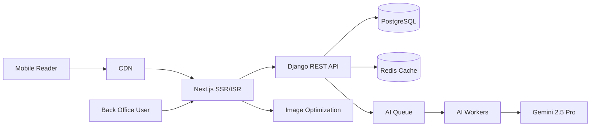
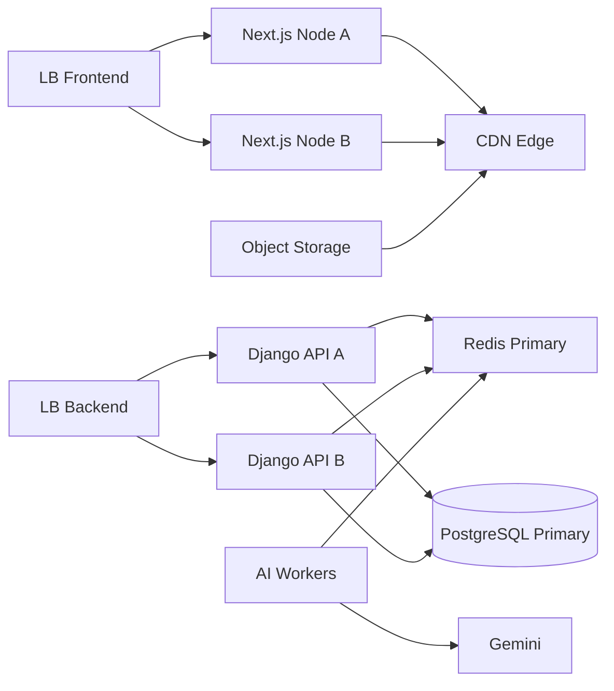
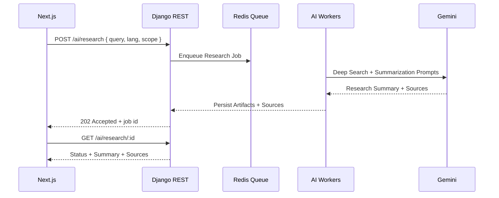
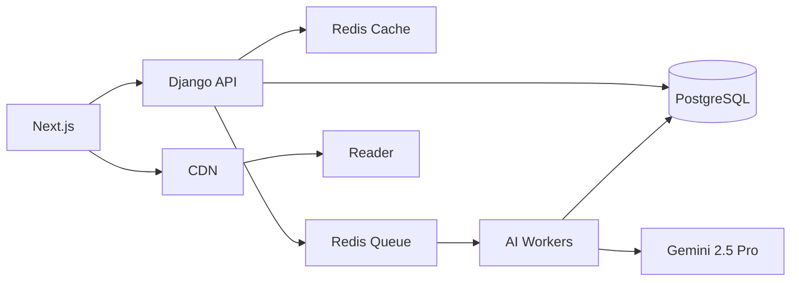
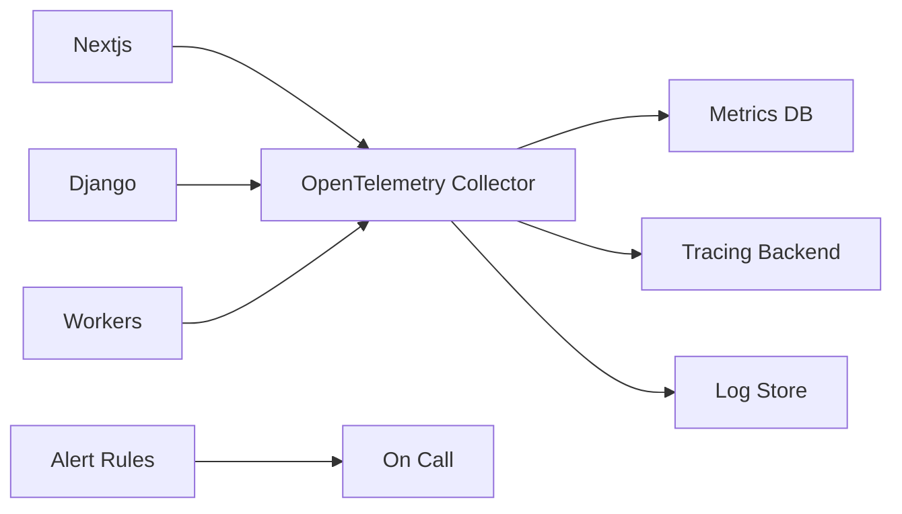

# System Architecture

Comprehensive architecture for THETUNISTIME: Next.js App Router frontend, Django backend, PostgreSQL, AI via Google Gemini 2.5 Pro, with strong i18n RTL support, performance, and security.

Cross references
- See Project Overview [docs/01-project-overview.md](docs/01-project-overview.md)
- See Functional Requirements [docs/02-functional-requirements.md](docs/02-functional-requirements.md)
- See Non-Functional Requirements [docs/03-non-functional-requirements.md](docs/03-non-functional-requirements.md)

---

## 1. Architectural Goals

- Bilingual AR FR with full RTL support
- Mobile-first performance tuned for Fast 3G and Slow 4G
- Strict security posture for back office operations and public site
- Scalable and observable services
- AI assistant with deep search and citation-driven draft generation

---

## 2. High-Level Architecture

Services
- Frontend
  - Next.js App Router with SSR and ISR
  - Locale aware routing and RTL CSS logical properties
- Backend
  - Django REST API
  - AI workers for deep search and draft generation
- Data
  - PostgreSQL primary DB; optional read replicas
  - Redis for caching and queues
- AI Provider
  - Google Gemini 2.5 Pro for generation and summarization
- Edge
  - CDN for static assets and cached HTML
  - Image optimization service

Mermaid overview

---

## 3. Deployment Topology

Environments
- Development local
- Staging pre-production
- Production multi-zone where possible

Topology
- Next.js nodes behind load balancer
- Django API nodes behind load balancer
- Redis cluster for cache and queues
- PostgreSQL primary with backups and optional read replica
- Object storage for media assets (e.g., S3 compatible)
- CDN for static and HTML cache

Mermaid deployment

---

## 4. Frontend Architecture

Next.js App Router
- Rendering strategy
  - SSR for dynamic pages requiring auth or fresh data
  - ISR for article, category, region pages with revalidation windows (60–300s)
- Localization
  - Route groups per locale /ar and /fr
  - Language switcher preserving path when translation exists
- RTL support
  - CSS logical properties margin inline padding inline
  - Direction aware components and mirrored icons

Performance pattern
- Critical CSS inline for above the fold content
- Route level code splitting and deferred non-critical widgets
- Image optimization with AVIF/WebP and responsive srcset
- Avoid heavy client JS for presentational UI

Security pattern
- Secure headers via Next.js middleware
- CSP with strict script sources and frame policies
- No secrets in client bundles

---

## 5. Backend Architecture

Django REST API
- Apps
  - Content
  - Categories
  - Regions
  - Media
  - Users and Roles
  - Workflow
  - AI Research and Generation
  - SEO
- Patterns
  - Class based views or DRF viewsets
  - Serializers enforce schema and validation
  - Permissions via DRF and custom decorators
- Performance
  - select_related and prefetch_related to reduce query count
  - Aggregates and materialized views for regional counts when needed
- Security
  - CSRF for forms
  - Rate limiting sensitive endpoints
  - Audit logging for workflow transitions

AI Workers
- Queues
  - Research jobs deep search
  - Generation jobs prompting pipeline
- Isolation
  - Separate process pool from web API to avoid blocking
- Resilience
  - Retries with exponential backoff
  - Circuit breakers on provider failures

Mermaid backend flow

---

## 6. Data Architecture

Primary store
- PostgreSQL for relational data with strict constraints

Caching
- Redis for hot reads and editorial dashboards
- Edge CDN caching for public SSR HTML and static assets

Queues
- Redis or compatible queue system for AI jobs

Media
- Object storage for media assets plus metadata persisted in DB

High level data flow

---

## 7. API Gateway and Contracts

- No external gateway required initially; LB with TLS termination
- Versioned endpoints /v1
- Authentication
  - Back office JWT or session based
  - Public endpoints read only
- Pagination limit and offset consistent across list endpoints
- ETags and cache control on GET endpoints

Note
- Detailed payload schemas will be defined in [docs/06-api-contracts.md](docs/06-api-contracts.md)

---

## 8. AI Pipeline Design

Research pipeline
- Input
  - Query, language AR FR EN, scope News Official Academic Social
- Steps
  - Source discovery via APIs and curated scrapers with ethical constraints
  - Deduplication and normalization
  - Summarization via Gemini
  - Confidence scoring and recency indicators
- Output
  - Research summary with linked sources persisted to AI artifacts

Generation pipeline
- Input
  - Selected research artifacts
  - Style preset e.g., Neutral Analytical Explainer
  - Target language AR or FR
- Steps
  - Prompt construction with structured outline Headline Intro Body Conclusion
  - Anti plagiarism guardrails firm instruction to synthesize and cite
- Output
  - Draft article sections
  - Citation list for verification

Mermaid AI pipeline

```mermaid
flowchart LR
Query --> Discover[Discover Sources]
Discover --> Dedupe[Deduplicate URLs]
Dedupe --> Summarize[Summarize via Gemini]
Summarize --> Score[Score Confidence Recency]
Score --> Store[Store Artifacts]
Store --> Generate[Generate Draft via Prompt]
Generate --> Cite[Cite Sources Panel]
Cite --> Editor[Editor Reviews and Edits]
```

---

## 9. Security Architecture

- TLS everywhere; HSTS after validation
- Secure headers in frontend and backend
- RBAC enforced in Django for Administrator Editor Journalist
- Audit logging for publish and deletion actions
- Secrets management with environment variables and vaults
- Input validation and content sanitization; CSP and HTML sanitizer

---

## 10. Observability Architecture

- Structured logs with request correlation IDs
- Metrics
  - API latency percentiles p50 p95 p99
  - Queue depth and processing times
  - DB connection utilization
  - Web vitals RUM
- Tracing
  - OpenTelemetry across Next.js Django and Workers
- Alerts
  - Error rate spikes, latency thresholds, queue saturation, DB replication lag

Mermaid observability

---

## 11. Scalability Architecture

- Horizontal scale Next.js and Django nodes
- DB scaling via read replicas and connection pooling
- Cache tier Redis with clustering
- Worker pool scaling based on queue depth with back pressure limits
- Rate limits per user and per IP for public endpoints

---

## 12. SEO and i18n Architecture

- Locale-specific routes and slugs
- Hreflang pairs and canonical per locale
- Structured data JSON LD for Article and Breadcrumb
- Sitemaps per locale generated on publish

---

## 13. Accessibility Architecture

- RTL aware design system components
- Semantic HTML and ARIA roles
- Keyboard navigation and visible focus
- Screen reader support for editors and rich text content

---

## 14. Failure Modes and Resilience

- AI provider outage
  - Circuit breaker; serve cached research summaries; allow manual drafting
- DB contention
  - Backoff, read replicas for read heavy dashboards
- CDN cache stale
  - Revalidation windows and purge on publish
- Worker crash
  - Auto restart with job retry policies

---

## 15. Security and Privacy Compliance

- Minimal PII storage for comments
- Data retention policies for logs drafts and artifacts
- Consent for cookies beyond essentials
- Regular dependency and SCA scanning

---

## 16. Infrastructure as Code and CI/CD

- IaC via Terraform or Pulumi for repeatable provisioning
- CI
  - Lint test security scan build
- CD
  - Blue green or rolling deploys
  - DB migrations with zero downtime strategy

---

## 17. Notion Documentation Upload via MCP (Plan)

Given the requirement to upload documentation to Notion through MCP:

Plan
- Implement a local MCP server notion-mcp exposing tools
  - create_page under a parent page by page id
  - upload_markdown to convert local markdown to Notion blocks
  - set_page_properties to tag language AR FR and section index
- Configure MCP settings to include NOTION_TOKEN and destination PAGE_ID
- Idempotent upsert
  - If a page with the same title exists under parent, update blocks instead of creating duplicates
- Mapping
  - Local docs paths to Notion page hierarchy defined in [docs/IA-Notion-Structure.md](docs/IA-Notion-Structure.md)

Note
- Implementation will be performed after architecture planning is approved and mode switched to code

---

## 18. Risks and Mitigations Overview

- AI hallucination and citation errors
  - Editor verification required; confidence indicators
- Performance regressions
  - Enforced budgets and monitoring
- Security misconfiguration
  - Least privilege, audits, automated checks
- SEO complexity in bilingual routing
  - Strict hreflang and canonical policies

---

## 19. Acceptance Criteria Snapshot

- End to end SSR/ISR flows operating within performance budgets
- AI pipelines enqueue and process jobs reliably with citations
- RBAC enforced across all back office operations
- Observability dashboards and alerts configured
- Documentation pages mapped and ready for MCP Notion upload

---

## 20. Next Steps

- Author data model and ERD [docs/05-data-model-erd.md](docs/05-data-model-erd.md)
- Define API contracts [docs/06-api-contracts.md](docs/06-api-contracts.md)
- Author AI module design [docs/07-ai-assistant.md](docs/07-ai-assistant.md)
- Plan CI/CD and IaC details [docs/14-devops-ci-cd.md](docs/14-devops-ci-cd.md)
- Prepare MCP Notion server scaffolding in code mode
