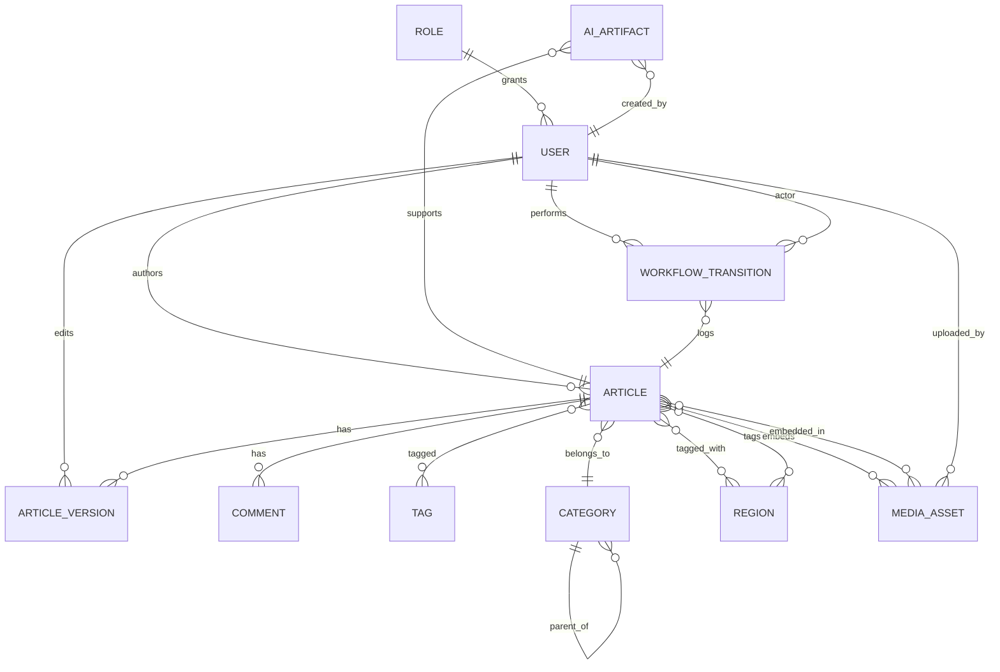
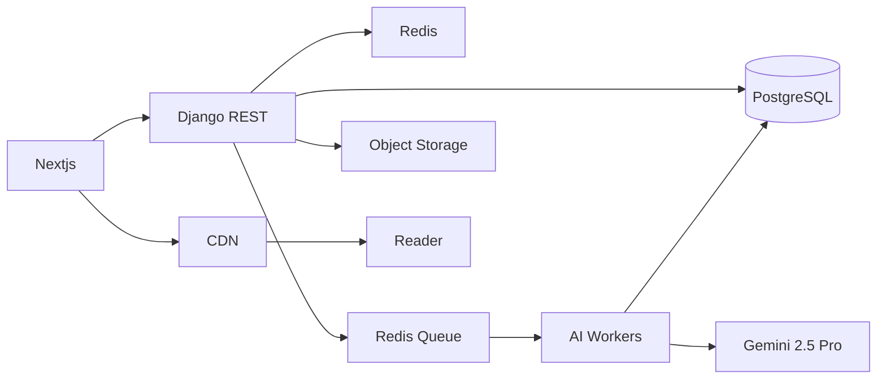

# Data Model and ERD

Entity reference and relationships for THETUNISTIME. This model supports bilingual content, regional tagging by Tunisian governorates, AI research artifacts, editorial workflows, SEO metadata, media assets, and auditability.

Cross references
- Project Overview [docs/01-project-overview.md](docs/01-project-overview.md)
- Functional Requirements [docs/02-functional-requirements.md](docs/02-functional-requirements.md)
- Non-Functional Requirements [docs/03-non-functional-requirements.md](docs/03-non-functional-requirements.md)
- System Architecture [docs/04-system-architecture.md](docs/04-system-architecture.md)

---

## 1. ERD Overview

Key entities
- Article
- Category
- Region
- Tag
- MediaAsset
- User
- Role
- ArticleVersion
- Comment
- AIArtifact
- WorkflowTransition

Mermaid ERD

---

## 2. Entity Definitions and Fields

### 2.1 Article

Purpose
- Represents a single article in a specific locale. Bilingual publishing can be modeled as separate Article rows per locale, cross-linked via hreflang peers.

Fields
- id UUID PK
- title Text required
- subtitle Text optional
- locale Enum values ar fr
- rtl Boolean derived from locale ar
- slug Text unique per locale
- body Rich text
- author_id FK to User
- editor_id FK to User nullable
- category_id FK to Category
- hero_media_id FK to MediaAsset nullable
- featured Boolean default false
- reading_time_min Integer computed on save
- publish_date Timestamp nullable for scheduled publish
- status Enum values draft in_review approved published archived
- canonical_url Text optional
- seo_title Text optional
- meta_description Text optional
- source_urls JSON array of strings optional
- region_tags Relationship to Region many to many
- tags Relationship to Tag many to many
- hreflang_peer_id FK to Article nullable cross locale counterpart
- version Integer for optimistic locking
- created_at Timestamp
- updated_at Timestamp

Indexes
- unique slug per locale
- index on status publish_date
- GIN on tags region_tags for search

Constraints
- If status published then publish_date must not be null

### 2.2 Category

Fields
- id UUID PK
- name_fr Text required
- name_ar Text required
- slug Text unique
- description Text optional
- parent_id FK to Category nullable
- color Enum optional
- weight Integer optional for ordering
- created_at Timestamp
- updated_at Timestamp

Indexes
- unique slug
- parent_id index

### 2.3 Region

Represents Tunisian governorates and other optional granularity levels.

Fields
- id UUID PK
- name_fr Text required
- name_ar Text required
- slug Text unique
- governorate_code Text optional
- region_type Enum values governorate municipality national
- color Enum optional
- coordinates Text optional lat lon or geojson ref
- created_at Timestamp
- updated_at Timestamp

Indexes
- unique slug
- region_type index

### 2.4 Tag

Fields
- id UUID PK
- name_fr Text required
- name_ar Text optional
- slug Text unique
- created_at Timestamp
- updated_at Timestamp

### 2.5 MediaAsset

Fields
- id UUID PK
- asset_name Text required
- type Enum values image video audio
- storage_url Text required object storage or CDN URL
- alt_text_fr Text optional
- alt_text_ar Text optional
- caption_fr Text optional
- caption_ar Text optional
- credit Text optional
- license Enum values internal cc_by cc_by_sa all_rights_reserved
- focal_point Text optional x y or crop metadata
- uploaded_by FK to User
- created_at Timestamp
- updated_at Timestamp

Indexes
- type index
- uploaded_by index

### 2.6 User

Fields
- id UUID PK
- name Text required
- email Email unique
- phone Text optional
- role_id FK to Role required
- department Enum optional
- locale_preference Enum values ar fr optional
- status Enum values active disabled
- created_at Timestamp
- updated_at Timestamp

Indexes
- email unique
- role_id index

### 2.7 Role

Fields
- id UUID PK
- name Enum values administrator editor journalist
- permissions JSON structured capability flags
- created_at Timestamp
- updated_at Timestamp

### 2.8 ArticleVersion

Immutable versions for auditability and diffing.

Fields
- id UUID PK
- article_id FK to Article
- version_number Integer monotonically increasing
- editor_id FK to User
- title Text snapshot
- subtitle Text snapshot
- body Rich text snapshot
- seo_title Text snapshot
- meta_description Text snapshot
- source_urls JSON snapshot
- created_at Timestamp

Indexes
- article_id version_number unique

### 2.9 Comment

Moderated reader comments.

Fields
- id UUID PK
- article_id FK to Article
- name Text required
- text Text required
- status Enum values pending approved rejected deleted
- ip_hash Text optional
- user_agent Text optional
- created_at Timestamp
- updated_at Timestamp

Indexes
- article_id index
- status index

### 2.10 AIArtifact

Stores the outputs of AI research and generation for traceability.

Fields
- id UUID PK
- article_id FK to Article nullable artifact can exist before article creation
- created_by FK to User
- language Enum values ar fr en
- search_scope JSON array values news official academic social
- query Text required
- summary Rich text
- sources JSON array of objects url title notes confidence recency
- draft Rich text optional initial generated draft
- status Enum values new in_progress ready archived
- created_at Timestamp
- updated_at Timestamp

Indexes
- created_by index
- status index
- language index

### 2.11 WorkflowTransition

Audit trail of state changes on articles.

Fields
- id UUID PK
- article_id FK to Article
- actor_id FK to User
- from_status Enum values draft in_review approved published archived
- to_status Enum values draft in_review approved published archived
- reason Text optional
- created_at Timestamp

Indexes
- article_id created_at index

---

## 3. Relationship Details

- Article belongs to Category
- Article has many Regions through article_regions
- Article has many Tags through article_tags
- Article has many MediaAsset embeds through article_media embedded list orderable
- Article has many Comments
- Article has many ArticleVersion snapshots
- Article has optional hreflang peer pointing to counterpart in other locale
- Article references hero media optionally

- Category self referencing parent child hierarchy single level or multiple levels
- Region used as many to many tagging for regional content and governorate mapping
- Tag used as flexible taxonomy beyond categories and regions

- AIArtifact linked to Article optionally; contains sources array for verification and citation
- WorkflowTransition logs editorial state changes with actor references

---

## 4. Table Schemas Sketch

Note This is conceptual. Concrete Django models and migrations will be defined in [docs/06-api-contracts.md](docs/06-api-contracts.md) and backend design documents.

Article
- PK id
- Unique slug locale composite
- FKs author_id editor_id category_id hero_media_id hreflang_peer_id
- M2M region_tags tags media_embeds

Category
- PK id
- Unique slug
- Parent child relationship

Region
- PK id
- Unique slug

Tag
- PK id
- Unique slug

MediaAsset
- PK id
- storage_url required
- uploaded_by FK

User
- PK id
- Unique email
- FK role_id

Role
- PK id
- permissions JSON

ArticleVersion
- PK id
- FK article_id
- Unique article_id version_number

Comment
- PK id
- FK article_id

AIArtifact
- PK id
- FK article_id created_by

WorkflowTransition
- PK id
- FK article_id actor_id

---

## 5. Data Integrity and Constraints

- Article status published requires publish_date not null
- Article hreflang peer must reference an Article with alternate locale and same conceptual slug root
- Region and Category slugs are immutable after publish to ensure stable URLs unless migration plan applied
- MediaAsset license must be present when asset used as hero media
- AIArtifact sources must contain at least one source entry before status ready
- WorkflowTransition disallows identical from_status to to_status values
- ArticleVersion version_number must increment by one per article

---

## 6. Indexing and Query Optimization

- Article indexes on status publish_date for newsroom dashboards
- Partial index where featured true for homepage queries
- GIN indexes on tags and regions for efficient filtering
- Materialized views optional for regional counts and latest headlines by governorate to accelerate homepage regional section
- Covering indexes on Comment status article_id for moderation queues
- Composite indexes on AIArtifact status created_at for research backlog views

---

## 7. Localization and RTL Data Strategy

- Locale specific Article rows with cross link via hreflang peer and shared conceptual slug root
- Bilingual Category and Region names with consistent slugs per locale mapping
- Rich text fields store language specific content; avoid mixed language content in same field unless editor controlled sections
- Numeral display handled at rendering; stored values are neutral

---

## 8. SEO Metadata Strategy in Data Model

- Store seo_title meta_description canonical_url per Article row
- Maintain sitemaps per locale based on published Article rows
- Persist JSON LD generation parameters or templates on backend; not required in DB fields but helpful in configuration tables

---

## 9. Media and Licensing

- Credit and license tracking on MediaAsset
- Relation between Article and MediaAsset supports hero and inline embeds separately
- Alt texts per locale to satisfy accessibility and SEO

---

## 10. Auditability and Versioning

- Full article snapshots in ArticleVersion enable diffing and rollback
- WorkflowTransition captures who did what when enabling editorial governance
- AIArtifact artifacts provide complete traceability of sources and generation

---

## 11. Migration and Data Evolution

- Slug changes require redirection mapping table optional before go live
- Region taxonomy updates handled via dedicated migration scripts and backfills
- Tag normalization routines to avoid duplicates across locales

---

## 12. Mermaid Data Flow

High level data interactions across services

---

## 13. Acceptance Criteria

- Entity relationships reflect bilingual publishing with hreflang peers
- Article supports category region tags media embeds and SEO metadata
- AIArtifact links sources and draft content with status lifecycle
- ArticleVersion and WorkflowTransition provide complete auditability
- Indexes and constraints align with performance and integrity targets

---

## 14. Next Steps

- Define API contracts and payload schemas for each entity in [docs/06-api-contracts.md](docs/06-api-contracts.md)
- Author AI module design details in [docs/07-ai-assistant.md](docs/07-ai-assistant.md)
- Prepare migration and seed plans for initial categories regions and roles