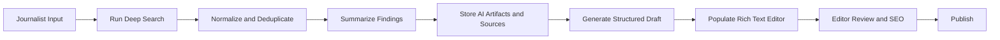
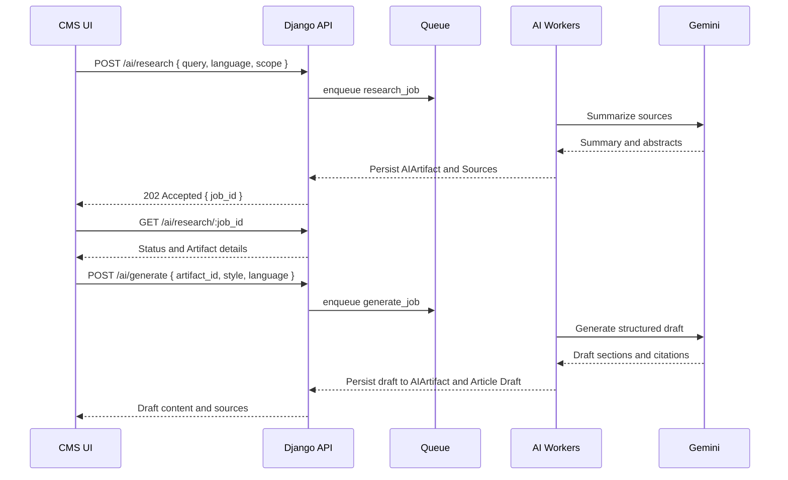
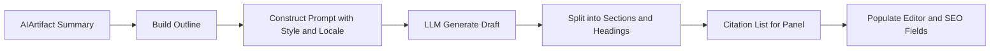

# AI Research and Generation Module Design

Design specification for the AI-powered assistant that performs deep web research and generates structured article drafts with full source citation, integrated into the back office CMS.

Cross references
- Project Overview [docs/01-project-overview.md](docs/01-project-overview.md)
- Functional Requirements [docs/02-functional-requirements.md](docs/02-functional-requirements.md)
- Non-Functional Requirements [docs/03-non-functional-requirements.md](docs/03-non-functional-requirements.md)
- System Architecture [docs/04-system-architecture.md](docs/04-system-architecture.md)
- Data Model and ERD [docs/05-data-model-erd.md](docs/05-data-model-erd.md)
- API Contracts [docs/06-api-contracts.md](docs/06-api-contracts.md)

---

## 1. Goals

- Accelerate journalist research with deep search aggregation across reputable sources
- Generate well-structured bilingual drafts in Arabic RTL and French LTR
- Enforce ethical synthesis and explicit citation to avoid plagiarism
- Integrate seamlessly with editorial workflows, SEO, and rich text editing
- Maintain responsiveness and reliability via asynchronous queues and caching

---

## 2. User Flows

- Journalist enters a research query and selects language AR FR EN and scope
- System runs deep search, normalizes sources, summarizes findings
- Journalist triggers Generate Article to produce a structured draft
- Sources panel displays all cited URLs with titles and notes for verification
- Editor reviews, edits, adds original reporting, and submits for publish

Mermaid overview

---

## 3. Deep Search Architecture

### 3.1 Source Types

- News outlets
- Official government sites and press releases
- Reputable international organizations and reports
- Academic articles and preprints
- Optional social signals with strong filtering for verification value

### 3.2 Discovery and Fetch

- Prefer official search APIs and curated feeds where available
- Ethical scraping policy
  - Respect robots.txt
  - Rate limit fetches
  - User agent identification
- Source metadata captured
  - URL, title, publication date, author if available, outlet, snippet

### 3.3 Normalization and Deduplication

- Canonical URL resolution
- Strip UTM and tracking parameters
- Hash content or abstract text to detect duplicates
- Cluster near-duplicate articles across syndication networks

### 3.4 Summarization

- Summarize key points per source
- Aggregate summary across sources highlighting corroborated facts and disagreements
- Confidence scoring heuristics
  - Outlet reputation, recency, cross-source corroboration

### 3.5 Caching

- Cache summaries per query language scope for short TTL
- Store source metadata and per-source abstracts for reuse

Data persistence
- Uses AIArtifact entity defined in [docs/05-data-model-erd.md](docs/05-data-model-erd.md)

---

## 4. Generation Architecture

### 4.1 Structured Output

- Headline
- Intro paragraph summarizing key points
- Body sections grouped by subtopics with headings
- Concluding paragraph
- Bilingual generation AR RTL and FR LTR based on selection

### 4.2 Anti-Plagiarism and Ethics

- Strict instruction to synthesize and avoid copying verbatim except short attributed quotes
- Support for inline quote blocks with attribution and link
- Sources panel lists all URLs used to construct the draft

### 4.3 Style Presets

- Neutral report
- Analytical deep dive
- Explainer guide
- Editor can choose style preset to influence tone and structure

### 4.4 Constraints and Locale

- Arabic generation uses RTL rendering with appropriate punctuation and numerals
- French generation uses LTR rendering and locale-aware typography
- Ensure paragraphs are cohesive and fact-based; avoid hallucinations by referencing source abstracts

---

## 5. Asynchronous Processing

- Queue jobs for research and generation to avoid blocking UI
- Workers consume jobs with retry and backoff policies
- Idempotency keys on job submission to prevent duplicate processing
- Back-pressure control with per-user quotas and organization-level rate limits

Mermaid job sequence

---

## 6. Prompt Design

### 6.1 Research Summarization Prompt (Concept)

Objective
- Summarize and synthesize key facts from multiple sources without copying text; produce concise bullet points and a narrative abstract indicating confidence and recency.

Inputs
- Language target
- Source abstracts with URL, title, outlet, published date
- Scope hints e.g., budget finance energy policy

Outputs
- Summary abstract
- Bullet points categorized by subtopics
- Confidence indicators and recency notes

### 6.2 Draft Generation Prompt (Concept)

Objective
- Produce a structured, coherent article draft with headline, intro, body sections, and conclusion, using synthesis only, and listing sources separately for verification.

Inputs
- Language target AR or FR
- Style preset Neutral Analytical Explainer
- Aggregated summary and categorized bullet points
- Source list references

Outputs
- Headline
- Intro
- Body sections with headings and paragraphs
- Conclusion
- Sources list references for panel

Notes
- Ensure Arabic text uses appropriate punctuation and readable sentence length
- Avoid direct translation artifacts; write naturally for locale

---

## 7. CMS Integration

### 7.1 Research UI

- Input fields
  - Query text
  - Language selection AR FR EN
  - Scope selection
- Results panel
  - Summary abstract
  - Source list table
    - Outlet, title, URL, published date, notes, confidence
  - Action buttons
    - Generate Draft
    - Save Artifact

### 7.2 Draft UI

- Rich Text Editor pre-populated with structured draft
- Sources side panel with URLs and notes
- SEO fields editor
  - Title, meta description, slug suggestion helper
- Versioning
  - Snapshots with diffs between AI draft and editor edits

### 7.3 Workflow Integration

- Draft → In Review transition when journalist submits
- Editor can annotate claims and mark verification flags
- Publish gated by editor approval and required SEO fields presence

---

## 8. Data Model Mapping

- AIArtifact stores summary, sources, and optional draft
- AIArtifact links to Article after generation or later
- ArticleVersion stores snapshots along the editorial lifecycle
- WorkflowTransition logs state changes and actor references

See [docs/05-data-model-erd.md](docs/05-data-model-erd.md) for entities.

---

## 9. Reliability, Rate Limits, and Quotas

- Role-based quotas
  - Journalist: N research requests per hour; M generation requests per day
  - Editor/Admin: elevated limits
- Per-IP rate limits on public endpoints
- Retry policies
  - Research jobs: max 3 retries with exponential backoff
  - Generate jobs: max 2 retries; on failure surface advisory to adjust scope or style
- Circuit breaker
  - If provider errors exceed threshold, disable generation temporarily and allow manual drafting

---

## 10. Security and Privacy

- Secrets
  - Gemini API key stored in server environment; never in client bundles
- Input sanitization
  - Clean HTML and embedded content in RTE; strip dangerous tags and attributes
- Compliance
  - Respect robots and terms of service for any scraping
- Audit
  - Log who initiated jobs, parameters, and outputs; immutable records in audit subsystem

---

## 11. Performance and UX

- Non-blocking UX with progress indicators for jobs
- Caching of research artifacts for quick retrieval
- Streaming output for generation if provider supports partials
- Lightweight UI components to meet mobile performance budgets

---

## 12. Telemetry and Metrics

- Research metrics
  - Time to complete, sources per query, cache hit rate
- Generation metrics
  - Time to generate, edits-to-publish ratio, style distribution
- Editorial metrics
  - Draft-to-publish lead times, review actions per draft
- Error metrics
  - Provider errors, timeouts, retry counts

---

## 13. Acceptance Criteria

- Research produces a summary and a non-empty source list with URLs and confidence indicators
- Generation produces headline, intro, body sections, conclusion in selected language and style
- Sources panel displays all URLs used with titles and notes
- RTE populated with structured draft; editor can modify all content and SEO fields
- Workflow transitions captured with audit logs
- Rate limits and quotas enforced; jobs queued and retried on transient failures
- No secrets exposed to clients; content sanitized

---

## 14. Risks and Mitigations

- Hallucinations or incorrect synthesis
  - Mitigation: enforce citations and editor verification flags; confidence indicators
- Source bias and low-quality outlets
  - Mitigation: outlet reputation scoring and filters; allow editor removal of sources
- Performance delays under load
  - Mitigation: queue scaling, back-pressure, cache reuse, job prioritization
- Ethical concerns with scraping
  - Mitigation: prefer APIs and official feeds; strict robotics compliance

---

## 15. Implementation Notes

- Workers
  - Python workers integrated with Django using Celery or RQ
- Prompts
  - Versioned prompt templates; admin-configurable presets for beats
- Idempotency
  - Use Idempotency-Key header for research and generation endpoints as described in [docs/06-api-contracts.md](docs/06-api-contracts.md)
- Localization
  - Ensure text is natural per locale; avoid literal translation where synthesis is intended

---

## 16. Mermaid Diagrams

Research pipeline detail

```mermaid
flowchart LR
Discover[Discover Sources] --> Fetch[Fetch and Extract Metadata]
Fetch --> Canonicalize[Canonicalize URLs]
Canonicalize --> Dedupe[Deduplicate and Cluster]
Dedupe --> Summarize[Summarize per Source]
Summarize --> Aggregate[Aggregate Narrative]
Aggregate --> Score[Score Confidence and Recency]
Score --> Persist[Persist AIArtifact and Source Records]
Persist --> Cache[Cache Summaries]
```

Generation pipeline detail

---

## 17. Next Steps

- Implement research and generation endpoints per [docs/06-api-contracts.md](docs/06-api-contracts.md)
- Scaffold worker queues and retry policies
- Define prompt templates and style presets with editorial input
- Build CMS UI components for research results and draft editor integration
- Prepare observability dashboards for AI workflows
