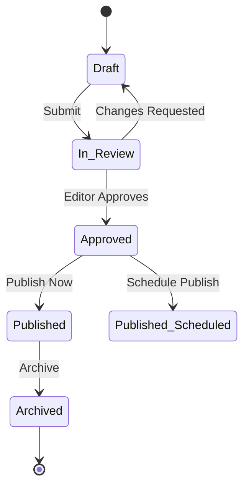
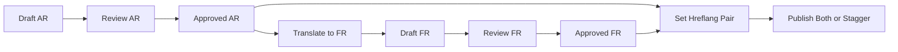
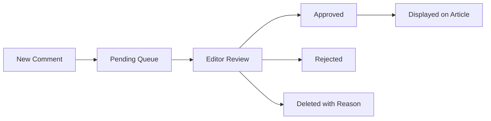

# Editorial Workflow and CMS Processes

Operational blueprint for administrators, editors, and journalists to produce bilingual, high quality news with AI assistance, rigorous review, and full auditability.

Cross references
- Project Overview [docs/01-project-overview.md](docs/01-project-overview.md)
- Functional Requirements [docs/02-functional-requirements.md](docs/02-functional-requirements.md)
- Data Model and ERD [docs/05-data-model-erd.md](docs/05-data-model-erd.md)
- AI Assistant Module [docs/07-ai-assistant.md](docs/07-ai-assistant.md)
- API Contracts [docs/06-api-contracts.md](docs/06-api-contracts.md)

---

## 1. Editorial Principles

- Accuracy first
  - AI is assistive, not authoritative. All claims must be verified by human editors.
- Transparency
  - Sources must be cited. Editorial notes should differentiate synthesis from original reporting.
- Bilingual parity
  - Arabic RTL and French LTR receive equal quality, localized tone, and proper SEO.
- Speed with discipline
  - Structured workflow transitions, checklists, and versioning maintain quality at pace.

---

## 2. Roles and Responsibilities

- Administrator
  - Manages users, roles, global settings, and has publish authority. Oversees governance and security.
- Editor
  - Reviews drafts, enforces standards, schedules publishing, moderates comments, and approves SEO readiness.
- Journalist
  - Initiates AI research, drafts articles, performs interviews and reporting, and submits for review.

RBAC mapping is defined in the data model and enforced by API endpoints. See [docs/06-api-contracts.md](docs/06-api-contracts.md) for endpoints and permissions.

---

## 3. Article Lifecycle

States
- Draft
- In Review
- Approved
- Published
- Archived

Transitions
- Draft → In Review (by Journalist)
- In Review → Approved or Changes Requested (by Editor)
- Approved → Published or Scheduled (by Administrator or Editor if policy permits)
- Published → Archived (by Administrator)

Mermaid state machine

Notes
- Changes Requested returns to Draft with editor comments
- Scheduled publish sets publish_date in the future and creates a release task

---

## 4. Bilingual Publishing Workflow

Approaches
- Parallel drafts per locale
  - Separate Article records in AR and FR with hreflang pairing
- Translation variant
  - Primary locale draft completed first then editorial translation ensuring localized tone

Process
- Journalist drafts in chosen primary locale
- Editor reviews and approves primary locale
- Translation step produces counterpart with localized SEO and typography
- Hreflang pair set between AR and FR articles before publish

Mermaid bilingual workflow

---

## 5. AI Assisted Workflow Integration

- Research
  - Journalist initiates deep search with scope and language. System produces summary and sources.
- Draft generation
  - Journalist triggers Generate Article to populate RTE with structured sections.
- Verification
  - Editor validates facts against source panel. Confidence indicators guide focus.
- Editorial enhancement
  - Add interviews, quotes, and localized context. Adjust style and structure as needed.
- SEO and compliance
  - Title, meta description, slug, structured data readiness confirmed before approval.

See detailed AI design in [docs/07-ai-assistant.md](docs/07-ai-assistant.md).

---

## 6. Editorial Checklists

### 6.1 Content Quality

- Headline is informative and non sensational
- Intro summarizes key points succinctly
- Body sections logically structured and readable in locale
- Claims verified against sources
- Quotes attributed and clearly delimited

### 6.2 Bilingual Specifics

- Proper RTL directionality for Arabic
- Locale specific numerals and punctuation where editorial policy requires
- Localized examples and references for audience relevance

### 6.3 SEO Readiness

- SEO title concise and keyword relevant
- Meta description ≤ 160 characters, engaging
- Canonical URL and hreflang pair configured
- Clean slug consistent with locale rules
- JSON LD present for Article schema

### 6.4 Accessibility

- Alt text present for images in both locales
- Headings and lists used semantically
- Color contrast and focus indicators upheld
- Keyboard navigation intact across RTE and forms

---

## 7. Versioning and Change Control

- Snapshots
  - Each major edit creates an ArticleVersion record
- Diffs
  - Editors can view changes between versions to audit
- Rollback
  - Approved rollback action restores previous version state excluding immutable fields like publish timestamps

Policies
- No force publish without at least one editor review
- Major changes post publish create a new version and update structured data modified date

---

## 8. Scheduling, Embargo, and Releases

- Scheduling
  - Approved articles can be scheduled with publish_date
- Embargo
  - Embargo flag prevents early access to content while allowing internal review
- Releases
  - Release notes tracked in Releases and Deployments database for operational visibility

Process
- Editor sets schedule and embargo
- System queues publish event and invalidates CDN cache on execution
- Sitemaps updated nightly and on publish events

---

## 9. Audit Logging and Governance

Audit events
- State transitions with actor, from_status, to_status, timestamp, and reason
- Publish and archive actions
- Comment moderation actions
- AI job submissions and completions

Governance
- Editorial standards documented and enforced via checklists
- Regular quality audits on published content
- Incident response procedures for corrections and retractions

---

## 10. Comments Moderation

- Intake
  - Comments created on article pages enter Pending
- Moderation queue
  - Editor reviews Pending items, approves or rejects
- Policies
  - Profanity filter and rate limits
  - Deletion must include moderation reason
- Display
  - Only Approved comments visible on public pages

---

## 11. Notifications and Assignments

- Assignments
  - Editor can assign drafts to specific journalists or reviewers
- Notifications
  - In app and optional email for state changes, schedule reminders, and moderation queue thresholds

SLA targets
- Draft to review submission median ≤ 24 hours
- Review to approval median ≤ 12 hours
- Publish on schedule within ± 5 minutes
- Moderation queue time to decision median ≤ 8 hours

---

## 12. Editorial Metrics and Reporting

Dashboards
- Throughput
  - Drafts created per journalist per week
- Lead time
  - Draft to publish median, p90
- Quality
  - Edits after publish ratio
- AI usage
  - Research jobs per beat, generation vs manual drafting ratio

Actions
- Use metrics to identify bottlenecks and training needs
- Continuous improvement through retrospectives

---

## 13. Workflow Failure Modes and Recovery

- Reviewer unavailable
  - Reassignment policy; escalation to secondary editor
- Schedule conflict
  - Publish window adjustment with clear communication
- Source dispute
  - Mark claim for verification, add editorial note or retract with correction process
- AI provider outage
  - Switch to manual research and drafting; persist artifacts for later completion

---

## 14. Mermaid Detailed Flows

Editorial lifecycle with AI checkpoints

```mermaid
flowchart LR
Start[Start Draft] --> AI_Research[AI Research]
AI_Research --> AI_Draft[AI Draft Generation]
AI_Draft --> Human_Edit[Human Editorial Edits]
Human_Edit --> Review[Editor Review]
Review --> Approved[Approved]
Approved --> SEO_Check[SEO Check]
SEO_Check --> Schedule[Schedule or Publish]
Schedule --> Publish[Publish]
Publish --> Moderation[Comments Moderation]
Moderation --> Measure[Metrics and Reporting]
```

Moderation flow

---

## 15. Acceptance Criteria

- Articles flow through Draft → In Review → Approved → Published with audit logs and versioning
- Bilingual pairs maintain hreflang and canonical rules with locale specific slugs
- AI research and generation integrate with RTE and source panel; editors can verify all claims
- Scheduling and embargo honored; CDN cache purged on publish
- Comment moderation queue operates with clear decisions and reasons
- Editorial checklists enforced; SEO and accessibility readiness verified
- Metrics dashboards reflect throughput and quality signals

---

## 16. Next Steps

- Implement workflow endpoints and UI per [docs/06-api-contracts.md](docs/06-api-contracts.md)
- Build moderation queue and notification system
- Finalize checklists and governance policies in configuration
- Integrate dashboards for editorial metrics and operational reporting