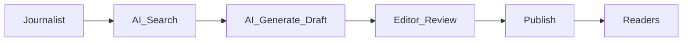
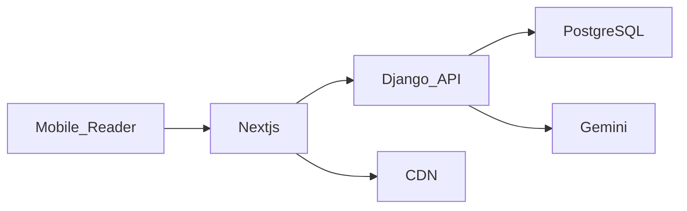

# THETUNISTIME Information Architecture and Notion Structure

This document defines the documentation IA and the Notion workspace structure for the bilingual, AI-powered news platform targeting Tunisia.

Stack reference: Frontend Next.js App Router, Backend Django, Database PostgreSQL, AI Google Gemini 2.5 Pro.

Notion destination page: THETUNISTIME Project, Page ID 1032efebb35a4693874efc14a9a44f53.

## Objectives

- Provide hierarchical pages for comprehensive documentation.
- Define Notion databases supporting editorial operations and AI research.
- Establish naming conventions, properties, and relationships.
- Map local docs files to Notion pages for upload.

## Notion Workspace Setup

1. Create a Notion internal integration and save token as secure secret (NOTION_TOKEN).
2. Share THETUNISTIME Project page with the integration to grant access.
3. Verify Page ID 1032efebb35a4693874efc14a9a44f53 corresponds to destination.
4. All uploads will occur under the THETUNISTIME Project page.

## Documentation Pages Hierarchy

01 Project Overview and Vision
02 Functional Requirements
03 Non-Functional Requirements
04 System Architecture
05 Data Model and ERD
06 API Contracts
07 AI Assistant Module
08 Editorial Workflow and CMS
09 Performance Strategy
10 Security and Privacy
11 SEO and SMO Strategy
12 i18n and RTL Strategy
13 Accessibility Guidelines
14 DevOps CI-CD and Observability
15 Risks Assumptions and Mitigations
16 Project Plan and Roadmap
17 Diagrams and ERD
18 Appendix and References

Each page will include cross-links and embedded diagrams where relevant.

## Notion Databases

- Articles
- Categories
- Regions
- Media Library
- Users and Roles
- AI Research Artifacts
- Editorial Tasks
- Releases and Deployments

### Articles database schema

Properties:
- Title (Title)
- Status (Select): Draft, In Review, Published, Archived
- Language (Select): AR, FR
- RTL (Checkbox)
- Category (Relation → Categories)
- Region (Relation → Regions)
- Tags (Multi-select)
- Author (Relation → Users and Roles)
- Editor (Relation → Users and Roles)
- Publish Date (Date)
- Slug (Text)
- SEO Title (Text)
- Meta Description (Text)
- Canonical URL (URL)
- Hreflang Peers (Relation → Articles, filtered by same slug different language)
- Featured (Checkbox)
- Hero Media (Relation → Media Library)
- Reading Time Min (Number)
- Source URLs (Multi-text or Multi-URL)
- AI Draft (Rich text)
- AI Sources (Rich text)
- Version (Number)
- Comments (Rich text)
- Created (Created time)
- Updated (Last edited time)

Views:
- Pipeline by Status
- By Language
- By Region
- Featured

### Categories database schema

Properties:
- Name (Title)
- Slug (Text)
- Description (Text)
- Parent Category (Relation → Categories)
- Color (Select)
- Weight (Number)

### Regions database schema

Properties:
- Name FR (Title)
- Name AR (Text)
- Slug (Text)
- Governorate Code (Text)
- Region Type (Select): Governorate, Municipality, National
- Color (Select)
- Coordinates (Text)

### Media Library database schema

Properties:
- Asset Name (Title)
- Type (Select): Image, Video, Audio
- File (Files and media)
- Alt Text FR (Text)
- Alt Text AR (Text)
- Caption FR (Text)
- Caption AR (Text)
- Credit (Text)
- License (Select): Internal, CC BY, CC BY-SA, All Rights Reserved
- Focal Point (Text)
- Related Articles (Relation → Articles)

### Users and Roles database schema

Properties:
- Name (Title)
- Role (Select): Administrator, Editor, Journalist
- Email (Email)
- Phone (Text)
- Department (Select)
- Locale Preference (Select): AR, FR
- Permissions Notes (Text)

### AI Research Artifacts database schema

Properties:
- Query (Title)
- Language (Select): AR, FR, EN
- Search Scope (Multi-select): News, Official, Academic, Social
- Summary (Rich text)
- Sources (Rich text)
- Draft (Rich text)
- Status (Select): New, In Progress, Ready, Archived
- Reviewer (Relation → Users and Roles)
- Related Article (Relation → Articles)
- Created (Created time)

### Editorial Tasks database schema

Properties:
- Task (Title)
- Status (Select): Todo, In Progress, Review, Done
- Assignee (Relation → Users and Roles)
- Due Date (Date)
- Related Article (Relation → Articles)
- Type (Select): Writing, Editing, SEO, Media

### Releases and Deployments database schema

Properties:
- Version (Title)
- Date (Date)
- Environment (Select): Dev, Staging, Prod
- Changes (Rich text)
- Owner (Relation → Users and Roles)

## Naming conventions

- Pages prefixed with two-digit index for ordering.
- Slugs lowercase with hyphens and language suffix when applicable.
- Categories simple lowercase slugs.
- Regions slugs match governorate names in FR transliteration.

## Upload mapping from local docs to Notion

Local files to be created:
- docs/01-project-overview.md → Page 01 Project Overview and Vision
- docs/02-functional-requirements.md → Page 02 Functional Requirements
- docs/03-non-functional-requirements.md → Page 03 Non-Functional Requirements
- docs/04-system-architecture.md → Page 04 System Architecture
- docs/05-data-model-erd.md → Page 05 Data Model and ERD
- docs/06-api-contracts.md → Page 06 API Contracts
- docs/07-ai-assistant.md → Page 07 AI Assistant Module
- docs/08-editorial-workflow.md → Page 08 Editorial Workflow and CMS
- docs/09-performance-strategy.md → Page 09 Performance Strategy
- docs/10-security-privacy.md → Page 10 Security and Privacy
- docs/11-seo-smo.md → Page 11 SEO and SMO Strategy
- docs/12-i18n-rtl.md → Page 12 i18n and RTL Strategy
- docs/13-accessibility.md → Page 13 Accessibility Guidelines
- docs/14-devops-ci-cd.md → Page 14 DevOps CI-CD and Observability
- docs/15-risks-assumptions.md → Page 15 Risks Assumptions and Mitigations
- docs/16-project-plan-roadmap.md → Page 16 Project Plan and Roadmap
- docs/17-diagrams-erd.md → Page 17 Diagrams and ERD
- docs/18-appendix.md → Page 18 Appendix and References

## Initial Mermaid diagrams

Flowchart of editorial and AI workflow:

System architecture overview:

## Notes

- Accessibility and RTL will be addressed in dedicated pages.
- AI tokens and secrets must be stored securely; never embed in Notion pages.
- All database relations use Notion relation properties to enable rollups.

## Next steps

- Author each documentation page under docs directory.
- Prepare MCP Notion server configuration and upload scripts.
- Execute upload once server is enabled.